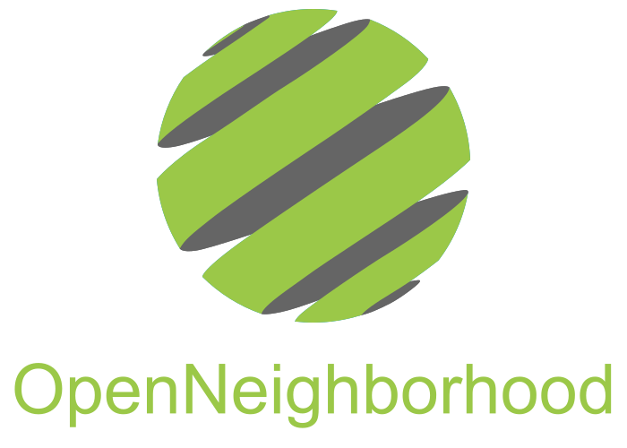
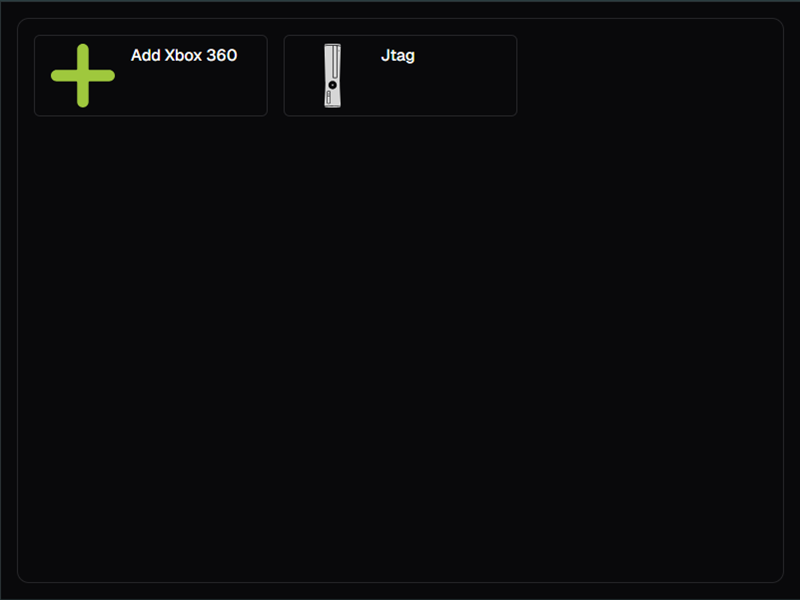
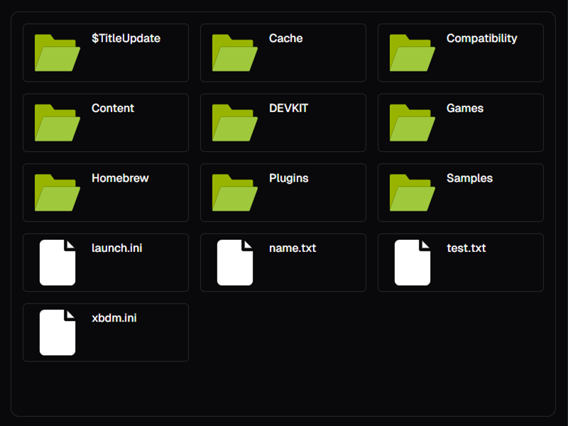

# OpenNeighborhood

<div align="center"></div>

Web-based clone of Xbox 360 Neighborhood.

# Screenshots

| Home                          | Root of HDD                           |
| ----------------------------- | ------------------------------------- |
|  |  |

## Build from source

**There are no prebuilt artifacts at the moment, the only way to use OpenNeighborhood is to build it from source.**

### Prerequisites

- [Node.js 18.18](https://nodejs.org/) or later.

### Development

```
npm install
npm run dev
```

Then the development server is listening on [localhost:3000](http://localhost:3000).

### Production

```
npm install
npm run build
npm start
```

Then the production server is listening on [localhost:3000](http://localhost:3000).
